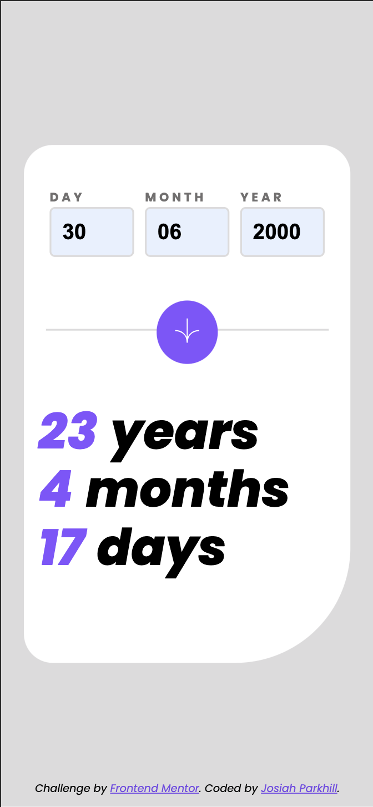
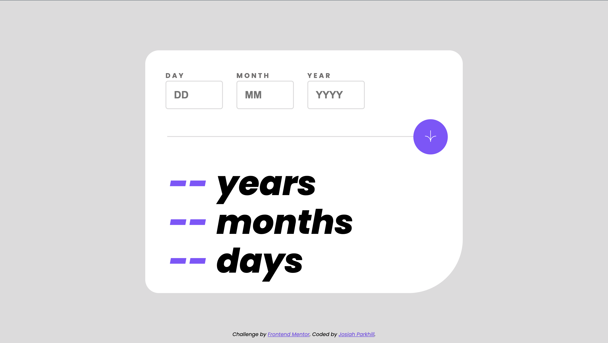
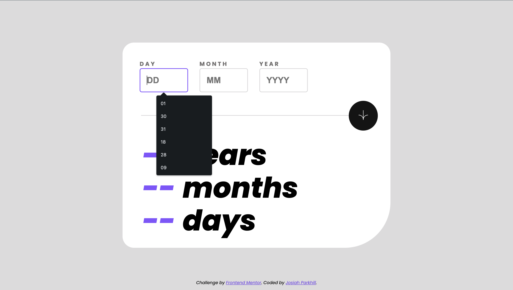
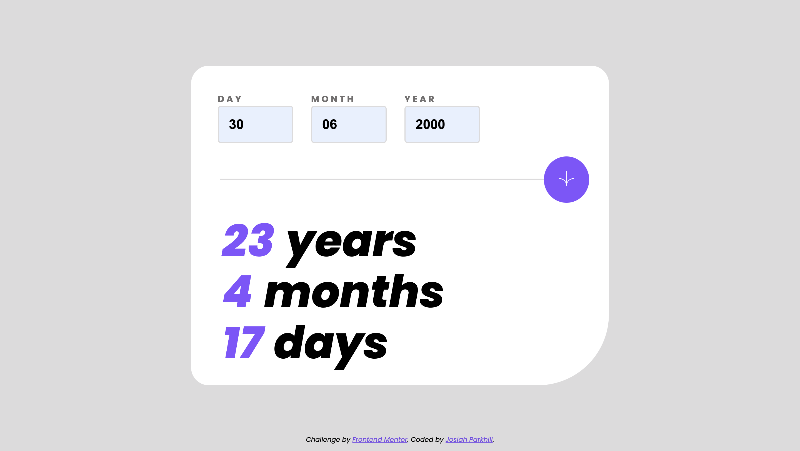
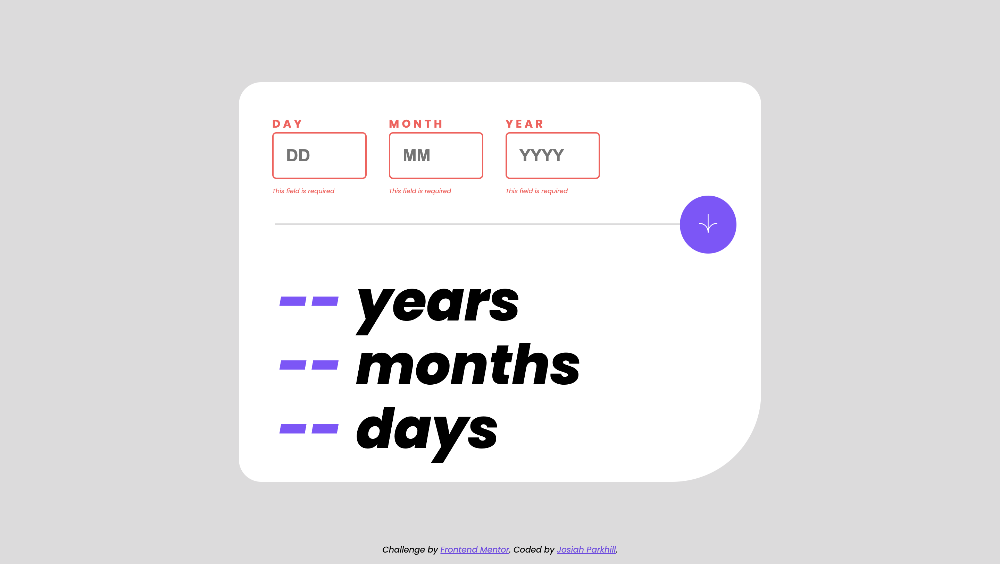
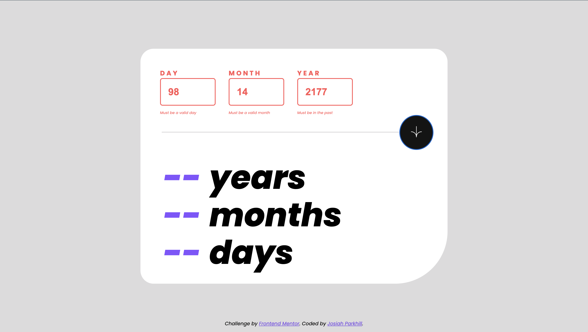

# Frontend Mentor - Age Calculator App

### Screenshots

### Links

- Solution URL: [https://age-calculator-app-jp.netlify.app/](https://age-calculator-app-jp.netlify.app/)
- Personal Webpage: [https://www.josiahparkhill.dev/](https://www.josiahparkhill.dev/)

### My Process

I started with a Mobile-First mentality, settling the HTML/Basic JS before moving into the CSS. This project allowed me to practice my vanilla JS.

### Built With

- Semantic HTML5 markup
- CSS custom properties
- Flexbox
- CSS Grid
- Mobile-first workflow
- JavaScript
